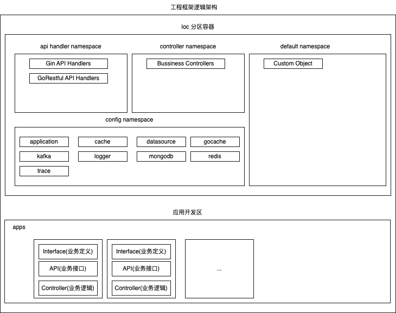

# mcube

[](https://codecov.io/gh/infraboard/mcube)
[](https://goreportcard.com/report/github.com/infraboard/mcube)
[](https://github.com/infraboard/mcube/releases)
[](https://github.com/infraboard/mcube/blob/master/LICENSE)

mcube是一款用于构建微服务的工具箱, 通过Ioc来为微服务提供通用功能



下面将mysql的配置托管给ioc 可以大大简化配置，让我们快速获取到GORM DB对象
```go
package test_test

import (
	"testing"

	"github.com/infraboard/mcube/ioc"
	"github.com/infraboard/mcube/ioc/config/datasource"
)

// 具体对象
func TestIocLoad(t *testing.T) {
	// 查询注册的对象列表, 通过导入datasource库 完成注册
	t.Log(ioc.Config().List())

	// 加载配置
	req := ioc.NewLoadConfigRequest()
	req.ConfigFile.Enabled = true
	req.ConfigFile.Path = "../etc/application.toml"
	err := ioc.ConfigIocObject(req)
	if err != nil {
		panic(err)
	}

	// 使用ioc对象(datasource配置 衍生对象), 
    // 这里为了避免Database配置被外部访问到 并没有直接选择暴露托管对象, 而是提供方法使用
    // ioc.Config().Get(DATASOURCE).(*dataSource).db
	t.Log(datasource.DB())
}
```

## 快速开始

下面是演示一个TestObject对象的注册与获取的基础功能:
```go
// 匿名对象
func TestObjectLoad(t *testing.T) {
    // 将*TestObject对象 注册到默认空间
	conf := ioc.Default()
	conf.Registry(&TestObject{})
	fmt.Println(ioc.Default().List())

    // 通过环境变量配置TestObject对象
	os.Setenv("ATTR1", "a1")
	os.Setenv("ATTR2", "a2")
	ioc.DevelopmentSetup()

	// 除了采用Get直接获取对象, 也可以通过Load动态加载, 等价于获取后赋值
    // ioc.Default().Get("*ioc_test.TestObject").(*TestObject)
    obj := &TestObject{}
	err := ioc.Default().Load(obj)
	if err != nil {
		t.Fatal(err)
	}
	t.Log(obj)
}

type TestObject struct {
	Attr1 string `toml:"attr1" env:"ATTR1"`
	Attr2 string `toml:"attr2" env:"ATTR2"`
	ioc.ObjectImpl
}
```

## 应用开发

下面将演示一个上图中 应用开发区的一个HelloWorld应用, 完整代码请参考: [样例代码](./docs/example/)

1. 定义Hello业务: helloworld包
```go
// 1. 业务定义
type HelloService interface {
	Hello() string
}
```

2. 实现Hello业务: helloworld/impl包
```go
func init() {
	ioc.Controller().Registry(&HelloServiceImpl{})
}

// 业务逻辑实现类
type HelloServiceImpl struct {
	db *gorm.DB

	ioc.ObjectImpl
}

// 控制器初始化
func (i *HelloServiceImpl) Init() error {
	// 从Ioc总获取GORM DB对象, GORM相关配置已经托管给Ioc
	// Ioc会负责GORM的配置读取和为你初始化DB对象实例,以及关闭
	i.db = datasource.DB()
	return nil
}

// 具体业务逻辑
func (i *HelloServiceImpl) Hello() string {
	return "hello world"
}
```

3. 定义Helloworl API接口: helloword/api包
```go
func init() {
	ioc.Api().Registry(&HelloServiceApiHandler{})
}

// 3. 暴露HTTP接口
type HelloServiceApiHandler struct {
	// 依赖业务控制器
	// 使用ioc注解来从自动加载依赖对象, 等同于手动执行:
	// 	h.svc = ioc.Controller().Get("*impl.HelloService").(helloworld.HelloService)
	Svc helloworld.HelloService `ioc:"autowire=true;namespace=controllers"`

	// 日志相关配置已经托管到Ioc中, 由于是私有属性，所有受到注入, 具体见下边初始化方法
	log *zerolog.Logger

	// 继承自Ioc对象
	ioc.ObjectImpl
}

// 对象自定义初始化
func (h *HelloServiceApiHandler) Init() error {
	h.log = logger.Sub("helloworld.api")
	return nil
}

// API路由
func (h *HelloServiceApiHandler) Registry(r gin.IRouter) {
	r.GET("/", h.Hello)
}

// API接口具体实现
func (h *HelloServiceApiHandler) Hello(c *gin.Context) {
	// 业务处理
	resp := h.Svc.Hello()
	h.log.Debug().Msg(resp)

	// 业务响应
	c.JSON(http.StatusOK, gin.H{
		"data": resp,
	})
}
```

4. 加载业务包 启动服务: main
```go
import (
    ...
	// 加载业务模块
	_ "github.com/infraboard/mcube/docs/example/helloworld/api"
	_ "github.com/infraboard/mcube/docs/example/helloworld/impl"
)

func main() {
	req := ioc.NewLoadConfigRequest()
    // 配置文件默认路径: etc/applicaiton.toml
	req.ConfigFile.Enabled = true
	err := ioc.ConfigIocObject(req)
	if err != nil {
		panic(err)
	}

	// 启动应用, 应用会自动加载 刚才实现的Gin Api Handler
	err = application.App().Start(context.Background())
	if err != nil {
		panic(err)
	}
}
```

5. 启动程序, 配置文件请参考: [程序配置](https://github.com/infraboard/mcube/blob/master/docs/example/etc/application.toml)
```sh
$ go run main.go 
2023-11-14T17:40:32+08:00 INFO   config/application/application.go:93 > loaded configs: [log.v1 app.v1 datasource.v1] component:APPLICATION
2023-11-14T17:40:32+08:00 INFO   config/application/application.go:94 > loaded controllers: [log.v1 app.v1 datasource.v1] component:APPLICATION
2023-11-14T17:40:32+08:00 INFO   config/application/application.go:95 > loaded apis: [*api.HelloServiceApiHandler.v1] component:APPLICATION
[GIN-debug] [WARNING] Creating an Engine instance with the Logger and Recovery middleware already attached.

[GIN-debug] [WARNING] Running in "debug" mode. Switch to "release" mode in production.
 - using env:   export GIN_MODE=release
 - using code:  gin.SetMode(gin.ReleaseMode)

[GIN-debug] GET    /exapmle/api/v1/          --> github.com/infraboard/mcube/docs/example/helloworld/api.(*HelloServiceApiHandler).Hello-fm (3 handlers)
2023-11-14T17:40:32+08:00 INFO   config/application/http.go:165 > HTTP服务启动成功, 监听地址: 127.0.0.1:8020 component:HTTP
```